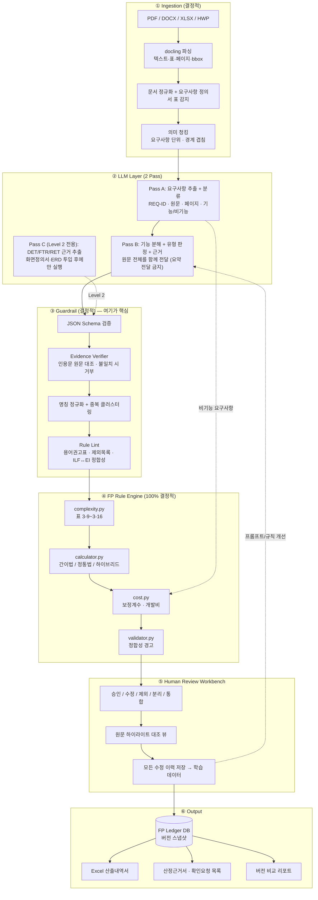
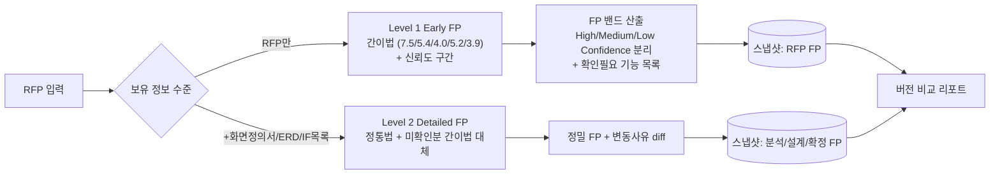

# RFP FP Estimation Agent — 구축계획서

> 대상: 국내 SI 사업 초기 RFP 기반 FP 1차 자동산정 + 전문가 검토 내부도구
> 작성 기준일: 2026-08-20 · 상태: 착수 판단용 v1.0
> 부속 산출물: `fp_engine/`, `rfp_pipeline/`(PDF/PPTX/XLSX/DOCX 파싱·Evidence 검증·SQLite Ledger), `schemas/llm_extraction.schema.json`, `docs/KR_FP_RULES.md`

---

## 0. 이 문서의 근거와 검증 수준

| 구분 | 내용 | 검증 방법 |
|---|---|---|
| **1차(공식)** | KOSA 「SW사업 대가산정 가이드」 **2025년 개정판** PDF 원문 표 3-8 ~ 3-25 | KOSA 게시판에서 직접 다운로드 후 텍스트 추출, 2020년판과 전량 diff |
| **1차(공식)** | 가이드 2.1.6 적용사례 (2020년판 85FP → 68,467,488원 / **2025년판 85FP → 74,796,821원**) | Rule Engine 이 **두 개정판 모두** 1원 단위로 재현 (`tests/test_fp_engine.py`) |
| **1차(공식)** | 기능점수당 단가 605,784원 | **2025년판 표 3-21 원문 확인** (기존 언론보도 2차자료를 대체) |
| **1차(GitHub)** | `872601188/nesma-fp-api` 실제 소스 | `analyzer.py` / `calculator.py` / `excel_generator.py` / README / 커밋로그 직접 확인 |
| **1차(GitHub API)** | 위 저장소의 라이선스 상태 | GitHub API `license: null`, `LICENSE`/`LICENSE.md`/`LICENSE.txt` 모두 404 |
| **2차** | NESMA Indicative 35/15 공식 | 공식 원문 미확인. 본 문서에서는 결론 근거로 사용하지 않음 |
| **미검증** | **공식 Excel 산정 템플릿과의 대조** | **미완.** 반올림 규칙은 두 개정판 적용사례에서 역산한 것 — Phase 0 필수 항목 |

### 2025년 개정판 대조 결과 (2020년판 대비)

| 항목 | 변경 여부 |
|---|---|
| 복잡도 매트릭스 (표 3-9/3-10/3-14/3-15/3-16) | 동일 |
| 정통법 가중치 (7/10/15, 5/7/10, 3/4/6, 4/5/7, 3/4/6) | 동일 |
| 간이법 평균복잡도 가중치 (7.5/5.4/4.0/5.2/3.9) | 동일 |
| 규모 보정계수 공식 및 상·하한 | 동일 |
| 애플리케이션 복잡도 보정계수 4종 × 5수준 | 동일 |
| 이윤 25% 상한 | 동일 |
| **기능점수당 단가** | **553,114원 → 605,784원 (변경)** |
| **단계별 발주 구분** | **설계사업 28.1% / 구축사업 71.9% 신설 (변경)** |

→ 개정판별 차이는 `fp_engine/rules.py` 의 `RULE_PACKS` 로 분리했고, **`edition` 은 기본값 없이 필수 인자**다. 과거 단가로 조용히 계산되는 사고를 구조적으로 막는다.

주의: 매트릭스·가중치 구조는 개정 이력상 안정적이나 **단가는 매년 바뀐다.** 연 1회 개정 대조를 운영 태스크로 등록한다.

---

## 1. Executive Summary

### 1.1 결론 먼저

**만들 가치는 있다. 단, 당신이 지금 설계한 그대로 만들면 실패한다.**

가장 중요한 지적부터 한다. 당신의 기획서는 "FP 산정 자동화"를 목표로 하지만, **FP 산정 업무에서 실제로 시간이 오래 걸리고 돈이 걸린 부분은 FP 계산이 아니다.**

- FP 계산 자체(복잡도 판정 → 가중치 → 합계 → 개발비)는 **이미 Excel 로 몇 분이면 끝난다.** 여기에 AI 를 넣어 얻는 이득은 0에 가깝다.
- 실제 병목은 ① **기능 인벤토리를 빠짐없이 만드는 것**, ② **발주자와 "이 기능이 몇 개인가"를 합의하는 것**, ③ **그 합의 근거를 문서로 남기는 것** 이다.
- 즉 이 시스템의 가치 제안은 "FP 를 자동 계산한다"가 아니라 **"RFP 300페이지에서 기능 인벤토리 초안과 원문 추적표를 반나절 만에 만든다"** 여야 한다.

당신이 3번 항목(Traceability)을 가장 중요하다고 쓴 것은 정확하다. **그게 사실 이 제품의 본체다.** FP 숫자는 부산물이다.

### 1.2 자동화 가능 수준 (현실적 기대치)

| 단계 | 현실적 자동화 수준 | 근거 |
|---|---|---|
| RFP → 요구사항 목록 구조화 | **80~90%** | 국내 공공 RFP 는 "요구사항 정의서"(SFR/PFR/…) 표 형식이 준표준화되어 있어 추출이 쉽다 |
| 요구사항 → 기능 후보 분해 | **60~75% (Recall 기준)** | 사람도 편차가 큰 영역. AI 는 "누락은 적고 과다는 많은" 방향으로 튜닝 가능 |
| EI/EO/EQ/ILF/EIF 판정 | **75~85%** | 가이드가 용어별 판정 권고표를 제공 → 규칙 + LLM 조합으로 실용 정확도 확보 |
| DET/RET/FTR 식별 | **RFP 단계 20~40% / 설계 단계 70%+** | **RFP 에는 원래 이 정보가 없다.** 이건 AI 성능 문제가 아니라 입력 정보 부재 문제 |
| 복잡도 · FP 계산 · 개발비 | **100% (Rule Engine)** | 구현됨. 공식 적용사례 2개 개정판과 1원 단위 일치 (공식 Excel 대조는 미완) |
| 산정근거 문서화 | **90%+** | 구조화만 되면 자동 |
| 발주자-수주자 조정 | **0%** | 협상이지 계산이 아니다 |

**종합: "전문가 8일 작업 → 2~3일" 수준이 현실적 목표.** "1시간 완전자동"은 불가능하며, 그걸 목표로 하면 신뢰를 잃고 도구가 사장된다.

### 1.3 가장 큰 기술적 난점 (난이도 순)

1. **DET/FTR/RET 정보 부재 (해결 불가, 회피해야 함).** RFP 에 화면정의서·ERD 가 없으므로 정통법에 필요한 카운트가 물리적으로 존재하지 않는다. → **RFP 단계는 간이법을 기본으로 하고, 정통법은 Level 2 로 미룬다.** 이걸 인정하지 않고 "AI 가 DET 를 추정"하게 두면 근거 없는 숫자가 계약 baseline 이 되어 사업 리스크가 된다.
2. **기능 단위 입도(granularity) 합의.** "고객관리"가 1개 기능인지 12개 기능인지가 FP 를 10배 흔든다. LLM 은 입도가 프롬프트·문맥마다 흔들린다. → 입도 규칙을 명시적 rubric 으로 고정하고, few-shot 을 사내 과거 산정서에서 뽑아 쓴다.
3. **중복 제거.** 300페이지를 청크로 나눠 처리하면 같은 기능이 여러 청크에서 반복 추출된다. LLM 이 아니라 **정규화 + 클러스터링 + 리뷰 UI** 로 풀어야 한다.
4. **표·이미지 기반 요구사항.** 국내 RFP 의 요구사항 정의서는 100% 표다. 표 구조가 깨지면 그 뒤 파이프라인 전체가 무의미해진다. → 파서 품질이 LLM 품질보다 중요하다.
5. **결과 재현성.** 같은 RFP 를 두 번 돌려 FP 가 달라지면 계약 문서로 못 쓴다. → 모델/프롬프트 버전 고정 + 스냅샷 + diff 기능이 필수.

### 1.4 추천 접근법 (한 줄)

**"FP 계산기"가 아니라 "근거가 붙은 기능 인벤토리 생성기 + 리뷰 워크벤치"를 만들고, FP 는 그 위에 얹는다. Rule Engine 을 먼저 완성하고(이미 완성됨), LLM 은 나중에 붙인다.**

---

## 2. FP 업무 프로세스 분석

현행 사람 프로세스를 12단계로 분해하고, 자동화 가능성과 **왜 그런지**를 함께 적는다.

| # | 단계 | AI(LLM) | Rule/코드 | 사람 | 자동화 판정 및 근거 |
|---|---|---|---|---|---|
| 1 | RFP 수령·문서 정규화(PDF/HWP/DOCX → 텍스트+표+페이지) | ✕ | **◎** | 점검 | 순수 엔지니어링. **HWP/HWPX 대응이 국내에서 실질 관문** |
| 2 | 측정 범위·애플리케이션 경계 결정 | △ | ✕ | **◎** | 경계 판단은 사업 범위 해석. AI 는 후보만 제시 |
| 3 | 산정 방법 결정(정통법/간이법) | ✕ | ○ | **◎** | 규칙화 가능하나 발주자 협의 사항 |
| 4 | 요구사항 추출·구조화(REQ-ID, 원문, 페이지) | **◎** | ○ | 검토 | RFP 요구사항 정의서 표가 준표준 → 추출 용이 |
| 5 | 기능/비기능/관리 요구사항 분류 | **◎** | ○ | 검토 | 비기능은 FP 대상 아님 → **보정계수 입력으로 라우팅**(이게 핵심 설계 포인트) |
| 6 | 단위프로세스(기능) 분해 | **○** | ✕ | **◎** | 최대 난제. AI 초안 + 사람 확정 |
| 7 | 데이터 기능(ILF/EIF) 식별 | ○ | **○** | ◎ | 가이드는 "EI 존재로 ILF 역추론" 방법을 명시 → **규칙 도출 가능** |
| 8 | 트랜잭션 유형(EI/EO/EQ) 판정 | **◎** | **○** | 검토 | 가이드 용어 권고표(16종) 를 규칙으로 선반영 후 LLM 보완 |
| 9 | DET/RET/FTR 식별 | △ | ○ | **◎** | RFP 단계에서는 정보 부재. **Level 2 로 이월** |
| 10 | 복잡도 판정 | ✕ | **◎** | ✕ | 완전 결정적. 구현 완료 |
| 11 | FP 합계 / 보정계수 / 개발비 | ✕ | **◎** | 입력 | 완전 결정적. 구현 완료. 보정계수 수준값은 사람이 확정 |
| 12 | 산정서·근거문서 작성 / 발주자 협의 | ○ | **◎** | **◎** | 문서 생성은 자동, 협의는 100% 사람 |

범례: ◎ 주담당 · ○ 보조 · △ 제한적 · ✕ 해당 없음

**읽는 법:** ◎가 Rule 열에 있는 단계(1, 10, 11)는 LLM 을 절대 넣지 않는다. ◎가 사람 열에 있는 단계(2, 6, 9, 12)는 자동화율 KPI 를 걸지 않는다. AI 의 실질 전장은 4·5·6·8 이다.

---

## 3. 국내 FP 기준 분석 (구현 사양)

### 3.1 반드시 알아야 할 사실 3가지

1. **국내 가이드는 IFPUG CPM 기반이다.** 복잡도 매트릭스와 가중치(7/10/15, 5/7/10, 3/4/6, 4/5/7, 3/4/6)가 IFPUG 와 동일하다. 가이드 본문도 "IFPUG CPM 을 참고하라"고 명시한다.
2. **국내 가이드는 VAF(GSC 14개)를 쓰지 않는다.** 이게 결정적이다. IFPUG 의 `AFP = UFP × VAF` 는 국내에 없다. 대신 **개발원가 단계에서 5개 보정계수**(규모, 연계복잡성, 성능요구수준, 운영환경 호환성, 보안성수준)를 곱한다.
   → **`nesma-fp-api` 는 VAF 를 적용한다. 국내 기준에서는 오답이다.**
3. **간이법은 "복잡도 판정을 못 할 때 쓰는 근사"가 아니라, 발주 단계의 정식 방법이다.** 가이드가 직접 "일반적으로 기능별 복잡도를 판별하기 어려운 경우(발주 시)에는 평균복잡도를 적용한 간이법을 사용" 이라고 규정한다. **즉 RFP 단계 FP 산정의 정답은 간이법이다.**

### 3.2 정통법 vs 간이법

| 항목 | 간이법 (평균복잡도법) | 정통법 (일반적인 방법) |
|---|---|---|
| 적용 시점 | 예산수립·발주·제안 단계 | 설계 완료 이후 |
| 필요 입력 | 기능 유형 + 개수 | + DET/RET/FTR 전량 |
| 가중치 | ILF 7.5 / EIF 5.4 / EI 4.0 / EO 5.2 / EQ 3.9 | 복잡도별 정수 가중치(표 3-9~3-16, 3-20) |
| **본 시스템 적용** | **Level 1 Early FP 의 기본 산식** | **Level 2 Detailed FP** |

### 3.3 구현해야 할 계산 체인 (구현됨 · 공식 Excel 대조 대기)

```
① 기능 식별  → ② 복잡도/가중치 → ③ 총 기능점수
                                        │
④ 보정전 개발원가 = FP × 단가 × Σ(단계별 가중치)
                                        │
⑤ 보정후 개발원가 = ④ × 규모 × 연계복잡성 × 성능 × 운영환경호환성 × 보안성
                                        │
⑥ 소프트웨어 개발비 = ⑤ + 이윤(⑤의 25% 이내) + 직접경비
```

주요 상수(전부 `fp_engine/rules.py` 에 출처 주석과 함께 존재):

- 규모 보정계수 = `0.4057 × (ln(FP) − 7.1978)² + 0.8878`, 500FP 미만 1.2800 / 3,000FP 초과 1.1530
  → **검증됨:** 이 공식은 FP=500 에서 1.2800, FP=3000 에서 1.1530 으로 정확히 수렴한다(테스트로 확인). 즉 공식과 상·하한이 정합적이다.
- 단계별 가중치: 분석 0.19 / 설계 0.24 / 구현 0.32 / 시험 0.25 (분할발주 대응)
- 기능점수당 단가: 553,114원(2020년판) → 605,784원(2024년 개정, 2차자료)
- 이윤: 개발원가의 25% 초과 불가 (국가계약법 시행규칙 제8조)

### 3.4 반드시 구현해야 하는 "숫자가 아닌 규칙"들

가이드는 계산식보다 **제외 규칙과 판정 관례**가 훨씬 분쟁을 많이 만든다. 이것들을 규칙 테이블로 코드화했다:

- **논리파일 식별 제외 목록**: 임시파일, 물리적 복사본, Sort File, 화면/보고서 추출파일, 기술적 코드파일, 인덱스, 조인파일, 키로만 구성된 관계파일, 백업파일
- **용어별 판정 권고표 16종**: 데이터적재/업로드/설정→EI, 발송/다운로드/로그인/사용자인증→EQ, 그래프/통계→EO, 로그아웃/코드/임시/이력/첨부/로그→**산정 제외**
- **연계 조회 관례**: 경계 밖 데이터 조회는 통상 `EIF 1 + EQ(또는 EO) 1`
- **공통모듈**: 원칙적으로 1회만 산정
- **투입공수 방식 예외 사업 5종**(콘텐츠/R&D/내부복잡도 과대/튜닝·테스트/5천만원 미만) → **시스템이 초기에 "이 사업은 FP 방식 대상이 아닐 수 있음"을 경고해야 한다**

### 3.5 반올림 규칙 — 실무 함정 (개정판 2종 대조로 확정)

가이드 본문에는 라운딩 규칙이 **없다.** 두 개정판 적용사례를 동시에 만족하는 규칙을 역산한 결과:

> **보정계수를 하나씩 순차적으로 곱하며, 매 단계 원 단위 반올림(ROUND_HALF_EVEN).**

| 가설 | 2020년판 (53,173,990 기대) | 2025년판 (58,237,457 기대) |
|---|---|---|
| 결합 곱 후 1회 절사 | 53,173,990 ✓ | 58,237,456 ✕ |
| 결합 곱 후 1회 반올림 | 53,173,991 ✕ | 58,237,457 ✓ |
| **순차 곱 + 매 단계 HALF_EVEN** | **53,173,990 ✓** | **58,237,457 ✓** |

**이것이 개정판 1종만으로 검증했을 때의 위험을 보여준다.** 2020년판만 봤을 때는 "절사"가 정답으로 보였고, 실제 초기 구현이 그렇게 되어 있었다. 2025년판을 대조하자마자 그 구현은 틀린 것으로 판명됐다.

**여전히 미검증:** 발주기관이 실제로 쓰는 **공식 Excel 산정 템플릿과는 대조하지 않았다.** 적용사례 2건에 적합(fit)한 규칙일 뿐, Excel 의 내부 셀 단위 반올림과 다를 수 있다. Phase 0 필수 항목이며, 그 전까지 이 엔진은 **prototype(검증 대기)** 이다.

---

## 4. GitHub / Open Source 조사

### 4.1 `872601188/nesma-fp-api` 코드 수준 평가

**실물 확인 결과 (2026-08-20 기준):** ⭐2 · Fork 0 · **총 커밋 5개** · 최초 커밋 2026-03-04, 최종 2026-03-05 · 단독 작성자 · MIT.

당신이 알고 있던 구조는 대체로 맞다(FastAPI + React, `analyzer.py`/`calculator.py`/`excel_generator.py`). 그러나 **내용은 기대와 다르다.**

| # | 평가 항목 | 결과 |
|---|---|---|
| 1 | 재사용 가능한가 | **거의 불가.** `analyzer.py` 는 **중국어 키워드 사전 기반 규칙**이다(`创建/添加/提交/导入`→EI, `查询/搜索/筛选`→EQ, `数据库/数据表`→ILF). 한국어 RFP 에 그대로 못 쓴다 |
| 2 | 코드 품질 | 낮음. 커밋 5개, 프로덕션 코드와 debug/test 스크립트가 뒤섞임, 테스트 커버리지 사실상 없음 |
| 3 | 유지보수 가능성 | 없음. 5개월간 커밋 없음, 기여자 1명, 이슈 1건 미해결. 사실상 개인 실험 저장소 |
| 4 | License | ⚠️ **표방 MIT, 라이선스 본문 부재.** README 는 "MIT, see LICENSE" 라고 쓰지만 `LICENSE`/`LICENSE.md`/`LICENSE.txt` 가 모두 404 이고 GitHub API 도 `license: null` 을 반환한다. **법무 확인 전 코드 재사용 금지** |
| 5 | NESMA vs 국내 FP 차이 | **치명적.** ① VAF(0.65 + GSC/100) 적용 → 국내 미사용 ② **DET/FTR/RET 계산이 아예 없음.** 복잡도를 `high_indicators >= 2 → High` 같은 키워드 개수 휴리스틱으로 결정 → **IFPUG/국내 기준 위반** ③ 간이법 평균복잡도(7.5/5.4/4.0/5.2/3.9) 개념 없음 |
| 6 | Analyzer 재사용 + Calculator 교체 가능? | **불가.** Analyzer 의 출력이 DET/FTR 을 담지 않으므로, 국내 Calculator 를 붙일 인터페이스 자체가 없다. 즉 교체가 아니라 재작성 |
| 7 | Excel Generator | **약 180줄 openpyxl 코드.** Summary/Components/Complexity Distribution 3~4 시트. **국내 "SW개발비 산출내역서" 양식과 무관.** 참고 가치: openpyxl 사용 패턴 정도(30분이면 직접 작성) |
| 8 | 보안 | 심각한 취약점은 미발견. 다만 **감사되지 않은 개인 저장소를 사내 RFP(대외비 포함) 처리 경로에 넣는 것 자체가 리스크**. 파일 업로드 경로 검증·인증 체계 부재 |
| 9 | LLM 의존인가 Rule 기반인가 | **순수 Rule(키워드 매칭) + 선택적 spaCy.** LLM 없음. → 당신이 원하는 "LLM 해석 + Rule 계산" 구조와 정반대로, **해석부가 규칙이고 계산부가 휴리스틱**이다. 완전히 뒤집혀 있다 |
| 10 | Fork vs 신규 | **신규 개발이 압도적으로 빠르다.** Fork 시 얻는 것: 프로젝트 스캐폴딩(수 시간). 버려야 하는 것: analyzer 전체, calculator 의 복잡도 로직, VAF. 남는 순이익 ≈ 0, 대신 잘못된 FP 로직을 물려받을 위험 |

**라이선스 주의:** 채택하지 않으므로 실무 영향은 없으나, 기록을 위해 명확히 한다 — 이 저장소는 **MIT 를 표방할 뿐 라이선스 본문이 없다.** 저작권법상 명시적 허락이 없는 코드는 기본적으로 all rights reserved 로 취급된다. 어떤 형태로든 코드를 참고·차용하려면 법무 확인이 선행되어야 한다.

**핵심 근거 1개만 남긴다면:** 이 저장소는 **DET/FTR/RET 를 세지 않는다.** DET/FTR/RET 없이는 정통법 FP 가 성립하지 않는다. 당신 기획서의 ③④번 요구사항을 이 코드는 구조적으로 만족시킬 수 없다.

### 4.2 추가 조사 — FP 오픈소스 생태계 현황

GitHub 를 실제 검색한 결과, **IFPUG/NESMA FP 관련 유지보수되는 오픈소스는 사실상 존재하지 않는다.** `function point analysis IFPUG` 최다 스타 저장소가 ⭐22(2015년, 스프레드시트)다. **한국어 "기능점수"/"대가산정" 저장소는 0건.**

이건 나쁜 소식이 아니라 **중요한 정보**다: FP 도구는 상용(ScopeMaster, Total Metrics, 국내 SI 사내툴) 영역이고, 우리가 만들 것에 대체재가 없다는 뜻이다. 동시에 **"오픈소스 조립"이라는 전략이 성립하지 않는다**는 뜻이기도 하다.

| Repository | 방식 | Language | 최근 관리 | License | 재사용 가능 부분 | 국내 FP 적합성 | 추천 |
|---|---|---|---|---|---|---|---|
| `872601188/nesma-fp-api` | 중국어 키워드 규칙 + VAF | Python/React | 2026-03 (커밋 5개) | ⚠️ MIT 표방·본문 부재 | 사실상 없음 (openpyxl 패턴 정도) | ✕ (VAF 사용, DET/FTR 없음) | **미채택** |
| `leftpudding/Function-Point-Spreadsheet` | IFPUG 수동 스프레드시트 | Excel/ODS | 2015 | 확인 필요 | **IFPUG 매트릭스 레이아웃 검증용** | △ (VAF 포함, 국내 보정계수 없음) | 참고만 |
| `deliaqi/myIFPUG` | 실험용 FPA 코드 | Java | 2020 | 확인 필요 | 없음 (언어 불일치, 실험 수준) | ✕ | 미채택 |
| `adautomeira/fp-control` | AI 스킬(프롬프트) 형태 FPA | Markdown | 2026-06 (⭐0) | 확인 필요 | **FPA 프롬프트 설계 아이디어** | ✕ (국내 기준 없음) | 아이디어만 |
| **`docling-project/docling`** | 문서 파싱(레이아웃/표/OCR) | Python | 활발 (⭐65k) | **MIT** | **PDF/DOCX/XLSX 파싱 + 표 구조 + 페이지 좌표. 로컬 실행 가능** | ◎ (기준 무관, 인프라) | **채택 권고** |

**정정:** 당신이 "오픈소스를 최대한 활용"하겠다고 한 방향은 맞지만, **활용해야 할 오픈소스는 FP 도메인이 아니라 문서 파싱 인프라**다. FP 도메인 코드는 남의 것을 쓰는 순간 국내 기준 불일치라는 최악의 리스크를 안는다.

### 4.3 최종 선택

> ### 🔴 **새로 개발** (Fork ✕, 부분 코드 활용 ✕)
>
> 단, **범위를 좁혀서.** FP 도메인 로직(Rule Engine)은 100% 자체 개발 — 이미 이 문서와 함께 완료되었고 공식 예제를 재현한다. 문서 파싱은 `docling`(MIT, 로컬 실행) 을 채택한다. Excel 생성은 `openpyxl` 직접 사용.
>
> **현재 구현 상태:** Rule Engine, 경량 문서 파이프라인, Evidence Verifier, SQLite Ledger, 최소 Streamlit 리뷰 UI가 동작한다(총 107 테스트). 공식 Excel 대조, 이미지/OCR과 공식 양식 Export는 아직 남아 있다. 운영 단계의 고정밀 PDF 표·좌표 추출에는 Docling 어댑터를 추가 검증한다.

---

## 5. Target Architecture

### 5.1 당신의 아키텍처에 대한 비판

당신의 다이어그램은 LLM Agent 를 4개(Requirement Extraction / Functional Decomposition / FP Classification / DET·FTR·RET Analyzer)로 나눈다. **이건 과분할이다.**

| 문제 | 설명 |
|---|---|
| 정보 손실 | 요구사항 추출 Agent 가 만든 요약을 다음 Agent 가 받으면 원문 맥락이 사라진다. FP 판정(EO vs EQ)은 **원문의 "집계", "산출" 같은 단어 하나**에 좌우된다 |
| 비용·지연 | 300페이지 RFP × 4단계 = 토큰 4배, 지연 4배 |
| 오류 증폭 | 1단계 Recall 0.85 × 2단계 0.85 × 3단계 0.85 ≈ **0.61**. 각 단계가 아무리 좋아도 곱해지면 무너진다 |
| 추적성 파괴 | 단계가 늘수록 "원문 → 최종 FP" 링크가 끊긴다. 이건 당신이 제일 중요하다고 한 요구사항이다 |

또한 다이어그램에 **없어서 실패하는 요소**가 4개 있다:

1. **Evidence Verifier** — LLM 이 인용한 원문이 실제로 문서에 존재하는지 문자열 대조. 없으면 hallucination 이 그대로 산정근거가 된다.
2. **Deduplication / Clustering** — 청크 경계에서 발생하는 중복 기능 병합.
3. **비기능 요구사항 → 보정계수 라우팅** — 성능/보안/연계 요구사항은 FP 가 아니라 **보정계수**로 가야 한다. 당신 설계에는 이 경로가 아예 없어서, 개발비 산정이 불가능하다.
4. **Version / Snapshot Store** — Level 1→2, RFP FP→분석 FP 비교의 기반.

### 5.2 수정 제안 아키텍처

**LLM 호출을 4개 Agent → 2개 Pass 로 통합**하고, 그 앞뒤를 결정적 코드로 감싼다.



### 5.3 Component 별 역할

| Component | 책임 | 절대 하지 않는 것 | 기술 |
|---|---|---|---|
| **Document Parser** | 원문 텍스트·표·페이지·좌표 보존 | 의미 해석 | docling(MIT, 로컬), 한글 문서는 HWPX→XML 또는 PDF 변환 |
| **Chunker** | 요구사항 단위 청킹, 경계 겹침 유지 | 요약 | 자체(표 행 단위 우선) |
| **Pass A (LLM)** | 요구사항 구조화 + 기능/비기능 분류 + 보정계수 신호 추출 | FP 판정 | LLM + Structured Output |
| **Pass B (LLM)** | 단위프로세스 분해, EI/EO/EQ/ILF/EIF 판정, 판정 근거·2순위 후보·되물을 질문 생성 | **숫자 계산, FP 산출** | LLM + Structured Output(원문 동봉) |
| **Evidence Verifier** | 모든 `quote` 가 원문에 문자열로 존재하는지 검증, 실패 시 후보 거부/격리 | 추측 보정 | 자체(정규화 후 exact/fuzzy match) |
| **Dedup Clusterer** | 명칭 정규화 → 유사 기능 클러스터 → 대표 선정 | 자동 삭제(리뷰 대기열로 보냄) | rapidfuzz + 임베딩(선택) |
| **Rule Lint** | 용어 권고표·제외목록·ILF↔EI 정합성 위반 탐지 | FP 변경 | `fp_engine/validator.py` |
| **FP Rule Engine** | 복잡도·가중치·FP·보정계수·개발비, 확실성 강제 | LLM 호출 | `fp_engine/` (구현됨) |
| **Review Workbench** | 승인/수정/제외/분리/통합 + 원문 대조 + 이력 | 자동 확정 | Streamlit(MVP) → React(확산기) |
| **Ledger / Version Store** | 스냅샷·diff·변동사유 | — | SQLite → PostgreSQL |
| **Exporter** | 산출내역서 Excel, 산정근거서, 확인요청 목록 | — | openpyxl |

### 5.4 Level 1 / Level 2 처리 분기 (핵심 설계)



**중요:** Level 1 에서 "1,420 FP (1,250~1,600)" 같은 밴드를 내려면 **밴드의 산출 방식이 통계적으로 정당화되어야 한다.** 임의로 ±12% 를 붙이면 안 된다. 권장 방식:

- 하한 = 확정 기능(High confidence)만으로 계산한 FP
- 기준값 = 확정 + 검토필요 기능
- 상한 = 확정 + 검토필요 + 누락추정분(과거 프로젝트의 "RFP FP → 최종 FP 증가율" 실측치 적용)

즉 **밴드의 상한은 AI 가 아니라 사내 과거 데이터가 만든다.** 데이터가 없는 초기에는 밴드를 제시하지 말고 "확정/검토필요 FP 분리 표기"만 하는 것이 정직하다.

---

## 6. AI / Rule Engine 역할분담

| 단계 | LLM | Rule Engine | Human | 경계 규칙 |
|---|---|---|---|---|
| 문서 파싱 | ✕ | **주** | 예외 확인 | LLM 에 원본 PDF 를 넘기지 않는다(페이지·좌표 손실) |
| 요구사항 추출 | **주** | 스키마/ID 검증 | 검토 | LLM 출력은 반드시 스키마 통과 |
| 기능/비기능 분류 | **주** | 라우팅 | 검토 | 비기능 → 보정계수 입력 |
| 단위프로세스 분해 | **주(초안)** | 입도 lint | **확정** | AI 결과는 항상 `AI_PROPOSED` 상태로 시작 |
| EI/EO/EQ/ILF/EIF 판정 | **주** | **용어권고표 대조 + 강제 경고** | 확정 | 규칙과 LLM 이 충돌하면 **자동 결정하지 않고 리뷰 큐로** |
| 인용·근거 | 생성 | **원문 대조 검증** | 확인 | 검증 실패 = 후보 폐기 |
| DET/RET/FTR | 근거 추출만 | 범위·이상치 검증 | **확정** | LLM 이 값을 "만들면" ESTIMATED 로만 저장 |
| 복잡도 판정 | ✕ | **단독** | ✕ | LLM 접근 금지 |
| FP 계산 | ✕ | **단독** | ✕ | LLM 접근 금지 |
| 보정계수 수준 결정 | 신호 제안 | 계수 조회 | **확정** | 계약 금액 직결 → 사람 확정 필수 |
| 개발비 산정 | ✕ | **단독** | 입력 | LLM 접근 금지 |
| 중복 판정 | 후보 제시 | 클러스터링 | **확정** | 자동 삭제 금지 |
| 산정서 생성 | 문장 다듬기(선택) | **주** | 승인 | 숫자는 전부 DB 에서 |

**한 문장 규칙: LLM 은 "무엇이 있는가"를 말하고, Rule Engine 은 "그것이 얼마인가"를 말한다. 숫자가 나오는 곳에 LLM 이 있으면 설계 오류다.**

---

## 7. 데이터 모델

```mermaid
erDiagram
    PROJECT ||--o{ DOCUMENT : has
    PROJECT ||--o{ ESTIMATION : has
    PROJECT ||--o| PROJECT_ACTUAL : "실적(사후)"
    DOCUMENT ||--o{ DOC_PAGE : contains
    DOCUMENT ||--o{ REQUIREMENT : yields
    REQUIREMENT ||--o{ REQ_FUNCTION_LINK : maps
    FP_FUNCTION ||--o{ REQ_FUNCTION_LINK : maps
    ESTIMATION ||--o{ FP_FUNCTION : contains
    ESTIMATION ||--|| FP_SUMMARY : produces
    ESTIMATION ||--o{ ADJUSTMENT_FACTOR : uses
    ESTIMATION ||--o{ COST_RESULT : produces
    FP_FUNCTION ||--o{ EVIDENCE : "근거"
    FP_FUNCTION ||--o{ FP_COUNT : "DET/RET/FTR"
    FP_COUNT ||--o{ COUNT_ITEM : "센 항목"
    COUNT_ITEM }o--|| EVIDENCE : "도출 근거"
    FP_FUNCTION ||--o{ REVIEW_EVENT : "수정이력"
    FUNCTION_LINEAGE ||--o{ FP_FUNCTION : "동일 기능 계보"
    FP_FUNCTION ||--o{ OPEN_QUESTION : "확인필요"
    ESTIMATION ||--o{ ESTIMATION_DIFF : "버전비교"
    LLM_RUN ||--o{ FP_FUNCTION : "생성출처"

    PROJECT {
        uuid id PK
        string name
        string business_type "차세대/구축/고도화"
        string ordering_org
        date rfp_date
        int budget_krw
    }
    DOCUMENT {
        uuid id PK
        uuid project_id FK
        string kind "RFP/과업지시서/화면정의서/ERD/IF목록"
        string filename
        string sha256 "동일문서 재처리 방지"
        int page_count
    }
    DOC_PAGE {
        uuid id PK
        uuid document_id FK
        int page_no
        text raw_text
        json tables
    }
    REQUIREMENT {
        uuid id PK
        uuid document_id FK
        string req_id "REQ-034"
        string rfp_req_code "SFR-012"
        string title
        text verbatim "원문 그대로"
        string business_area
        string req_class "FUNCTIONAL/NON_FUNCTIONAL/..."
        int page_no
    }
    ESTIMATION {
        uuid id PK
        uuid project_id FK
        string stage "RFP/분석/설계/확정"
        string method "SIMPLE/DETAILED"
        int version
        string status "DRAFT/IN_REVIEW/CONFIRMED"
        string rules_version "가이드 개정판 식별자"
        timestamp confirmed_at
    }
    FP_FUNCTION {
        uuid id PK
        uuid estimation_id FK
        uuid lineage_id FK "버전간 동일기능 추적 - 유형과 무관"
        string name
        string function_type "ILF/EIF/EI/EO/EQ - 변경되어도 lineage 는 유지"
        string complexity "엔진 계산결과 - 읽기전용"
        float fp "엔진 계산결과 - 읽기전용"
        string confirmation "CONFIRMED/PROVISIONAL - 엔진 계산결과"
        float ai_confidence
        string status "AI_PROPOSED/APPROVED/MODIFIED/EXCLUDED/MERGED"
        uuid merged_into FK
    }
    FUNCTION_LINEAGE {
        uuid id PK
        uuid project_id FK
        string display_name "최초 식별 시 명칭 - 표시용일 뿐 식별자가 아님"
        uuid split_from FK "기능 분리 시 부모 lineage"
        uuid merged_into FK "기능 통합 시 대상 lineage"
        timestamp created_at
    }
    FP_COUNT {
        uuid id PK
        uuid fp_function_id FK
        string count_type "DET/RET/FTR"
        int value
        string certainty "MEASURED/ESTIMATED/UNKNOWN/NEEDS_REVIEW"
        text rationale
        string review_status "PENDING/CONFIRMED/REJECTED"
        string confirmed_by
    }
    EVIDENCE {
        uuid id PK
        uuid fp_function_id FK
        uuid document_id FK
        int page_no
        text quote "원문 대조 검증 통과분만"
        json bbox
        string evidence_type "CLASSIFICATION/DET/FTR/EXCLUSION"
    }
    COUNT_ITEM {
        uuid id PK
        uuid fp_count_id FK
        string item_name "센 항목 그 자체 (예: 계약번호)"
        uuid evidence_id FK "문자열이 아닌 참조 - 문서/페이지/bbox/인용문에 연결"
    }
    REVIEW_EVENT {
        uuid id PK
        uuid fp_function_id FK
        string reviewer
        string action "APPROVE/MODIFY/EXCLUDE/SPLIT/MERGE"
        json before
        json after
        text reason "필수 - 발주자 협의 근거"
        timestamp created_at
    }
    OPEN_QUESTION {
        uuid id PK
        uuid fp_function_id FK
        text question
        string status "OPEN/ANSWERED"
        text answer
    }
    ADJUSTMENT_FACTOR {
        uuid id PK
        uuid estimation_id FK
        string factor_name "규모/연계복잡성/성능요구수준/운영환경호환성/보안성수준"
        int level
        float value
        text rationale
    }
    FP_SUMMARY {
        uuid id PK
        uuid estimation_id FK
        float total_fp
        float confirmed_fp
        float provisional_fp
        float data_fp
        float transaction_fp
        json unresolved_function_ids
        json counts_by_type
    }
    COST_RESULT {
        uuid id PK
        uuid estimation_id FK
        int unit_price
        int price_year
        int base_dev_cost
        int adjusted_dev_cost
        int profit
        int direct_expense
        int software_dev_cost
    }
    ESTIMATION_DIFF {
        uuid id PK
        uuid from_estimation FK
        uuid to_estimation FK
        uuid lineage_id FK "유형이 바뀌어도 같은 계보로 추적된다"
        string change_type "ADDED/REMOVED/TYPE_CHANGED/COMPLEXITY_CHANGED/SPLIT/MERGED"
        float fp_delta
        text reason
    }
    LLM_RUN {
        uuid id PK
        uuid estimation_id FK
        string model
        string prompt_version
        float temperature
        json token_usage
        string input_hash
    }
    PROJECT_ACTUAL {
        uuid id PK
        uuid project_id FK
        float final_fp
        float dev_mm
        int duration_days
        float ai_tool_usage_ratio
        float productivity_fp_per_mm
    }
```



**설계 의도 4가지:**

1. **`FUNCTION_LINEAGE` (기능 계보) — 식별자에 유형을 넣지 않는다.**
   초기 설계는 `stable_key = 기능명 정규화 + 유형 해시` 였는데, 이건 자기모순이다. EQ 로 잡았던 기능을 리뷰에서 EO 로 고치면 키가 바뀌고, 시스템은 이를 `TYPE_CHANGED` 가 아니라 **"기존 기능 삭제 + 신규 기능 추가"** 로 오인한다. 즉 가장 흔한 수정(EQ↔EO)이 계보를 끊는다.
   → 기능의 정체성은 **최초 식별 시 부여된 영속 UUID(`lineage_id`)** 다. 유형·명칭·복잡도는 전부 그 계보 위에서 바뀌는 속성이며, 분리/통합은 `split_from`/`merged_into` 로 별도 모델링한다.
2. **`FP_COUNT` — DET/RET/FTR 을 컬럼이 아니라 엔티티로.**
   초기 설계는 `det_certainty` 컬럼 하나만 두어 RET/FTR 의 확실성을 표현할 수 없었다. 카운트를 엔티티로 분리하면 세 축 모두 `certainty` 와 `review_status` 를 독립적으로 갖는다. "FTR=2 는 측정값인가 추정값인가"에 답할 수 있어야 한다.
3. **`COUNT_ITEM.evidence_id` — 출처를 문자열이 아니라 FK 로.**
   `source: "화면정의서 p12"` 같은 문자열은 참조 무결성이 없다. 근거 문서가 개정됐을 때 **어느 카운트가 영향받는지 질의할 수 없다.** EVIDENCE 로 연결하면 문서·페이지·bbox·인용문까지 추적되고, 문서 버전 변경 시 영향 범위를 역질의할 수 있다.
4. `PROJECT_ACTUAL` — 10번 요구사항(장기 데이터 축적) 대응. 지금은 비어 있어도 스키마에 자리를 만들어둬야 나중에 소급 입력이 가능하다.

---

## 8. LLM Structured Output Schema

전체 스키마는 `schemas/llm_extraction.schema.json` 에 있다. **당신의 예시 대비 개선점**:

| 당신의 예시 | 문제 | 개선 |
|---|---|---|
| `"det": 12` | 값만 있고 출처·확실성 없음 | `{"value":12,"certainty":"MEASURED","items":["고객명","계약번호",...]}` — **센 항목을 나열**해야 추적 가능 |
| `"source_page": 47` | 페이지만으로는 근거 확인에 페이지 전체를 읽어야 함 | `evidence: [{page, section, quote, bbox}]` — **인용문 + 좌표** |
| `"evidence": "..."` (문자열 1개) | 판정근거/DET근거가 섞임 | `evidence_type` 으로 분리 |
| `requirement_id` 1:1 | 기능 1개가 여러 요구사항에 걸치는 경우 표현 불가 | `requirement_ids: []` (N:M) |
| `function_type` 단일값 | "왜 EO 가 아니라 EQ 인가"에 답 못함 | `function_type_alternatives: [{type, why_not}]` **+ `classification_rationale`** |
| — | 되물을 것이 없음 | `open_questions: []` → 그대로 발주자 확인요청 목록이 됨 |
| — | 재현성 없음 | `model_fingerprint` (모델·프롬프트버전·temperature·seed) |
| `"confidence": 0.82` | LLM 자기보고 신뢰도는 캘리브레이션이 안 됨 | 유지하되 **정렬 용도로만 사용.** 임계값으로 자동승인 금지 |

핵심 샘플:

```json
{
  "document_id": "doc-2026-0412",
  "chunk_id": "p047-p049",
  "model_fingerprint": {"model": "<model-id>", "prompt_version": "passB-v0.3", "temperature": 0},
  "requirements": [{
    "req_id": "REQ-034",
    "rfp_req_code": "SFR-021",
    "title": "계약내역 조회",
    "verbatim": "고객은 본인이 체결한 계약의 내역(계약번호, 계약일자, 상품명, 계약금액, 상태)을 조회할 수 있어야 한다.",
    "requirement_class": "FUNCTIONAL",
    "business_area": "계약관리",
    "source": {"page": 47, "section": "3.2.1 계약관리", "quote": "고객은 본인이 체결한 계약의 내역", "bbox": [72, 410, 523, 448]}
  }],
  "function_candidates": [{
    "candidate_id": "FC-0112",
    "requirement_ids": ["REQ-034"],
    "name": "계약내역 조회",
    "function_type": "EQ",
    "classification_rationale": "조회 결과에 수학적 계산·공식·파생데이터가 없고 ILF 를 갱신하지 않으며 시스템 동작을 변경하지 않음 → 가이드상 EQ. 가이드 용어권고표에서도 단순 조회는 EQ.",
    "function_type_alternatives": [
      {"function_type": "EO", "why_not": "합계·집계 항목이 원문에 명시되지 않음. 단, 화면에 '총 계약금액' 이 있으면 EO 로 전환됨"}
    ],
    "unit_process_check": {"is_self_contained": true, "is_meaningful_to_user": true, "leaves_business_consistent": true},
    "counts": {
      "det": {"value": 6, "certainty": "ESTIMATED",
              "rationale": "원문에 열거된 표시항목 5개 + 조회조건/응답메시지 미확인",
              "items": ["계약번호", "계약일자", "상품명", "계약금액", "상태"]},
      "ftr": {"value": null, "certainty": "UNKNOWN", "rationale": "참조 논리파일이 RFP 에 정의되지 않음"}
    },
    "referenced_data_functions": ["계약정보"],
    "evidence": [{"page": 47, "section": "3.2.1", "quote": "계약번호, 계약일자, 상품명, 계약금액, 상태", "bbox": [72, 430, 480, 448]}],
    "confidence": 0.82,
    "status": "NEED_REVIEW",
    "open_questions": [
      "계약내역 조회 화면에 합계/집계 항목이 포함되는가? (포함 시 EO)",
      "조회 시 상품 마스터 등 추가 참조 파일이 있는가? (FTR 확정 필요)"
    ]
  }]
}
```

**주목:** 이 JSON 어디에도 `fp`, `complexity`, `weight` 필드가 없다. **의도적이다.** LLM 이 그 필드를 채울 수 있게 두는 순간 원칙 1이 무너진다.

---

## 9. FP Rule Engine 설계 (구현됨 · 공식 Excel 대조 대기)

```
fp_engine/
├── types.py        # FunctionType, Complexity, Method, Certainty, Counted, FPFunction, FPResult
├── rules.py        # ★ 기준의 유일한 원천: 매트릭스/가중치/단가/보정계수/용어권고표/제외목록
├── complexity.py   # determine_complexity() — 표 3-9~3-16 순수 조회
├── calculator.py   # 간이법 / 정통법 / 하이브리드 fallback
├── cost.py         # 규모보정계수, 애플리케이션 복잡도 보정계수, 개발비 6단계
├── validator.py    # 중복·오분류·이상치·정합성 lint (FP 를 바꾸지 않고 경고만)
└── __init__.py
tests/test_fp_engine.py   # 공식 예제 2개 개정판 1원 단위 재현 + 확실성 강제
tests/test_llm_schema.py   # LLM 스키마 조건부 무결성 강제 검증
```

### 설계 규칙

1. **`rules.py` 외부에 숫자 리터럴 금지.** 개정판 반영이 파일 1개 수정으로 끝나야 한다.
2. **모든 결과에 `derivation` 문자열 동봉.** 예: `"표 3-16 외부조회(EQ)...: FTR=2(행2), DET=12(열2) → AVERAGE; 가중치=4 (표 3-20)"`. 산정근거서가 이 문자열로 자동 생성된다.
3. **입력 부족 시 조용히 기본값을 쓰지 않고 예외를 던진다** (`InsufficientData`). 하이브리드 대체는 **명시적 옵션**일 때만, 그리고 대체 사실을 `derivation` 에 남긴다.
4. **`validator` 는 FP 를 변경하지 않는다.** 경고만 만들고 판단은 사람에게 넘긴다(원칙 7).
5. **`rules_version` 을 산정 결과에 각인.** 가이드 개정 후 과거 산정을 재현할 수 있어야 한다.

6. **확실성(certainty)과 기능 검토 상태 강제는 계산 지점에서 이뤄진다.** 스키마나 문서가 아니라 `calculator.py` 가 집행한다:
   카운트는 `MEASURED` → 확정 가능 / `ESTIMATED` → **잠정 FP 로 분리** / `UNKNOWN` → 값 자체를 가질 수 없음(`types.Counted` 가 거부) / `NEEDS_REVIEW` → 값이 있어도 사용 거부한다. 기능 유형도 `APPROVED`/`MODIFIED`일 때만 확정 가능하며, `AI_PROPOSED`/`NEED_REVIEW`는 간이법에서도 잠정값이다.
   결과는 `total_fp` 하나가 아니라 `confirmed_fp` / `provisional_fp` / `unresolved_function_ids` 로 분리되어 나온다. **"근거 없음/검토 필요" 값이 확정 총계에 들어가는 경로는 없다.**
7. **개정판(`edition`)은 기본값 없이 필수 인자.** 단가는 개정판마다 바뀌고(85FP 예제 기준 633만원 차이), 기본값을 두면 과거 단가로 조용히 계약금액이 산출된다.

### 검증 상태

```
$ python3 -m pytest tests/ -q
107 passed
```

**통과한 것**
- 공식 적용사례를 **두 개정판 모두** 1원 단위 재현: 2020년판 85FP → 68,467,488원 ✓ / 2025년판 85FP → 74,796,821원 ✓
- 5개 유형 × 매트릭스 경계값 28 케이스 ✓
- 규모 보정계수 공식이 500FP/3,000FP 경계에서 공표값에 수렴 ✓
- 동일 입력 100회 반복 시 동일 결과 ✓ (원칙 2)
- 확실성 강제: `UNKNOWN` + 값 조합 거부, `NEEDS_REVIEW` 값의 정통법 사용 거부, `ESTIMATED` 의 확정/잠정 분리 ✓
- LLM 스키마 조건부 무결성: `UNKNOWN`→value null, `MEASURED`→items 필수, 근거 없는 후보 거부 ✓

**아직 통과하지 못한 것 (도입 전 필수)**
- ❌ **공식 Excel 산정 템플릿과의 대조.** 반올림 규칙은 적용사례 2건에 적합한 것일 뿐이다
- ❌ 사내 과거 사업 확정 산정서와의 대조 (Phase 0 골든셋)

→ 따라서 이 엔진의 현재 상태는 "완료"가 아니라 **prototype (공식 Excel 검증 대기)** 이다.

---

## 10. 화면 설계 (Wireframe)

MVP 는 **Streamlit 8화면**. React 는 사용자가 늘고 동시편집이 필요해질 때.

**① 프로젝트 생성 / ② RFP 업로드**
```
┌──────────────────────────────────────────────────────┐
│ 신규 FP 산정                                          │
│ 사업명 [                    ] 발주기관 [           ]  │
│ 사업유형 (•)신규구축 ( )고도화 ( )차세대              │
│ 산정단계 (•)RFP ( )분석 ( )설계 ( )확정               │
│ 산정방법 (•)간이법  ( )정통법   ⓘ RFP단계 권장: 간이법 │
│ ─────────────────────────────────────────────────── │
│ 문서 업로드  [RFP.pdf ✓ 312p]  [+ 화면정의서]         │
│ ⚠ 이 사업은 '콘텐츠 관련 사업'일 수 있습니다.          │
│   → 투입공수 방식 예외 대상인지 확인하세요            │
│                                    [ 분석 시작 ]      │
└──────────────────────────────────────────────────────┘
```

**③ 분석 Progress** — 단계별 상태 + 실패 청크 노출(조용한 실패 금지)
```
파싱 ████████████ 312/312p  표 84개 감지
Pass A 요구사항 ██████████░░ 268/312p   추출 214건
Pass B 기능분해 ████░░░░░░░░  92/214건  후보 337개
근거검증  ⚠ 인용 불일치 11건 격리
중복 클러스터링 대기
```

**④ 요구사항 목록** — 좌: 목록 / 우: 원문 PDF 하이라이트 (**반드시 나란히**)
```
┌ REQ 목록 ────────────┬ 원문 (p.47) ─────────────────┐
│ REQ-032 계약등록  2건 │  3.2.1 계약관리              │
│▸REQ-034 계약내역조회 1│  ██고객은 본인이 체결한 계약의██│
│ REQ-035 계약해지  3건 │  ██내역(계약번호, 계약일자,  ██│
│ ...                   │  ██상품명, 계약금액, 상태)를 ██│
│ [기능] [비기능] [미분류]│  조회할 수 있어야 한다.       │
└───────────────────────┴──────────────────────────────┘
```

**⑤ FP Candidate Review** — 이 화면이 제품의 심장
```
┌ FC-0112  계약내역 조회 ───────────────── conf 0.82 ⚠NEED_REVIEW ┐
│ 유형  [EQ ▾]   ⓘ 2순위: EO — "합계 항목이 있으면 EO"            │
│ 근거  가이드상 계산·파생데이터 없음 → EQ                         │
│ DET   [ 6 ] (추정) 근거항목: 계약번호/계약일자/상품명/계약금액/상태│
│ FTR   [ – ] (미확인)                                            │
│ ──────────────────────────────────────────────────────────────  │
│ 간이법 FP = 3.9    (정통법 산정 불가: FTR 미확인)                │
│ 원문 ▸ RFP p.47 "계약번호, 계약일자, 상품명…"        [원문보기]  │
│ ⚠ Lint: 없음                                                    │
│ 확인요청 ▸ 합계 항목 포함 여부  ▸ 추가 참조파일 여부             │
│ [승인] [수정] [제외] [기능분리] [다른기능과통합]   사유[        ]│
└─────────────────────────────────────────────────────────────────┘
필터: [전체 337] [승인 210] [검토필요 98] [중복의심 21] [근거불일치 8]
일괄: [유형별 일괄승인] — ⚠ 사유 입력 없이는 비활성
```

**⑥ FP Summary**
```
Level 1 Early FP (간이법)
┌────────────────────────────────────────────┐
│ 확정 FP (근거 있음) 1,182.4 FP  ▓▓▓▓▓▓▓░░  │
│ 잠정 FP (추정 포함)   237.6 FP  ▓▓░░░░░░░  │
│ 미산정 (정보 부족)     38건                │
│ 제외                   48.0 FP             │
│ ─────────────────────────────────────────  │
│ FP 범위          1,182.4 ~ 1,420.0 FP      │
│ 확인필요 기능          38건  → 확인요청서   │
└────────────────────────────────────────────┘
유형별  ILF 42 / EIF 8 / EI 156 / EO 61 / EQ 92
개발비  보정계수 [규모 자동 0.92][연계 3▾][성능 3▾][운영 2▾][보안 3▾]
        → 보정후 개발원가 ₩___  이윤 25% ₩___  개발비 ₩___
⚠ 밴드(1,250~1,600)는 과거 프로젝트 실측 데이터 3건 이상부터 표시됩니다.
```

**⑦ Excel Export** — 산출내역서 / 기능목록 / 산정근거 / 확인요청 4종
**⑧ 버전 비교**
```
RFP FP 1,420  →  분석 FP 1,510   (+90)
 추가된 기능  +52건 (+128.4 FP)  ▸ 대량 배치 12건 (RFP 미기재)
 삭제된 기능  -9건  (-31.2 FP)
 유형 변경    14건  (+8.6 FP)   ▸ EQ→EO 11건 (집계항목 확인)
 복잡도 변경  0건   (간이법→간이법)
```

---

## 11. MVP 범위 (4~6주)

### Must Have
1. **FP Rule Engine** (간이법 + 정통법 + 보정계수 + 개발비) — **완료**
2. PDF/DOCX 파싱 + 페이지·표 보존 (docling)
3. Pass A/B LLM 파이프라인 + JSON Schema 강제
4. **Evidence Verifier** (인용 원문 대조)
5. Streamlit 리뷰 UI: 요구사항 목록 / 후보 리뷰 / 승인·수정·제외 / 원문 대조
6. **SQLite Ledger + 전체 수정 이력**
7. Excel Export 2종: 기능목록(근거 포함), SW개발비 산출내역서
8. 과거 프로젝트 1건 회귀 테스트 세트

### Should Have
9. 중복 클러스터링 + 병합 UI
10. 기능 분리/통합
11. Rule Lint 경고 UI 노출
12. 확인요청 목록 Export
13. 정통법 하이브리드(미확인분 간이법 대체)

### Later (MVP 제외 — 명시적으로 자르는 것)
- ❌ React SPA (Streamlit 로 충분)
- ❌ 버전 비교/diff (Level 2 가 존재해야 의미 있음)
- ❌ FP 밴드 자동 산출 (실측 데이터 없이는 근거 없는 숫자)
- ❌ HWP 직접 파싱 (PDF 변환으로 우회)
- ❌ 사용자 피드백 기반 자동 재학습 (수집만)
- ❌ 다중 사용자 동시편집 / SSO / 권한관리
- ❌ MM·생산성 분석 대시보드
- ❌ 이미지/도식 내 요구사항 OCR 해석
- ❌ 발주자 포털 공유

---

## 12. 개발 단계 — 당신의 Phase 순서 재설계

**당신의 순서(Phase 0 기준확보 → 1 Rule Engine → 2 Document → 3 Classification → 4 UI → 5 Pilot)는 거의 맞다.** 단, 두 가지를 바꾼다.

| 변경 | 이유 |
|---|---|
| **Phase 0 에 "과거 산정서 골든셋 확보"를 추가하고, 이것을 착수 게이트로 만든다** | 과거 RFP + 확정 FP 산정서 세트가 **없으면 이 프로젝트는 평가 불가능하고, 평가 불가능한 AI 프로젝트는 반드시 실패한다.** 최소 3건, 이상적으로 5~8건 |
| **Phase 4(리뷰 UI)를 Phase 3(분류) 앞으로 당긴다** | LLM 분류 품질은 **사람이 보면서 프롬프트를 고쳐야** 올라간다. UI 없이 분류를 튜닝하면 JSON 을 눈으로 읽는 데 시간을 다 쓴다. 최소 리뷰 UI 를 먼저 만든다 |

수정된 순서:

```
Phase 0  기준 확보 + 골든셋 확보 (★착수 게이트)
Phase 1  Rule Engine + 골든 테스트          ← 완료
Phase 2  Document → Requirement (파싱·청킹·Pass A)
Phase 3  최소 리뷰 UI + Ledger              ← 순서 변경
Phase 4  기능 분해 + 유형 판정(Pass B) + Evidence Verifier + 프롬프트 반복
Phase 5  Export + Lint + 중복제거
Phase 6  Pilot (과거 사업 재산정 · KPI 측정)
Phase 7  (조건부) Level 2 정통법 · 버전비교 · React
```

**Phase 7 은 Pilot KPI 를 통과했을 때만 착수한다.** 통과 못 하면 도구를 확장하는 게 아니라 프롬프트/규칙을 고쳐야 한다.

---

## 13. Pilot 계획 및 평가체계

### 13.1 원칙: Total FP 오차로 성공을 판정하지 않는다

**당신의 지적이 정확하다. 그리고 이유는 생각보다 심각하다.**

Total FP 는 **오차가 상쇄된다.** ILF 를 12개 놓치고(-90 FP) EQ 를 30개 과다 생성하면(+117 FP) 총계 오차는 +5% 로 보인다. 겉보기엔 훌륭하지만 **기능 목록은 완전히 틀렸고, 발주자 검토에서 즉시 무너진다.**

따라서 평가는 **기능 단위 매칭 기반**이어야 한다.

### 13.2 평가 프로토콜

1. 과거 사업 N건(≥3, 목표 5~8)의 RFP + **확정 FP 산정서**를 확보
2. 확정 산정서의 기능 목록을 정답(Ground Truth)으로 정규화
3. AI 결과와 정답을 **기능 단위로 매칭** (명칭 정규화 + 유형 + 사람 판정 보조)
4. 매칭 결과에서 지표 산출

### 13.3 KPI

| 계층 | KPI | 정의 | MVP 목표 | 운영 목표 |
|---|---|---|---|---|
| **입력** | Requirement Recall | 확정 산정서 근거 요구사항 중 추출된 비율 | ≥ 0.90 | ≥ 0.95 |
| | 페이지 근거 정확도 | 인용 페이지가 실제와 일치 | ≥ 0.95 | ≥ 0.98 |
| **핵심** | **FP Function Recall** | 정답 기능 중 AI 가 찾은 비율 | **≥ 0.80** | ≥ 0.90 |
| | **FP Function Precision** | AI 기능 중 정답에 있는 비율 | ≥ 0.70 | ≥ 0.80 |
| | 유형 분류 정확도(매칭된 것 중) | EI/EO/EQ/ILF/EIF | ≥ 0.80 | ≥ 0.88 |
| | **EQ↔EO 혼동률** | 별도 추적 (가장 흔한 오분류) | ≤ 0.15 | ≤ 0.08 |
| | **ILF/EIF 혼동률** | 별도 추적 (데이터기능은 FP 가중치가 커서 영향 큼) | ≤ 0.15 | ≤ 0.10 |
| | 중복 생성률 | 동일 기능 중복 후보 비율 | ≤ 0.10 | ≤ 0.05 |
| **Level2** | DET 오차(MAE) | 매칭 기능 기준 | 측정만 | ≤ 3 |
| | FTR 정확도 | 완전 일치 비율 | 측정만 | ≥ 0.70 |
| **결과** | Total FP 오차 | \|AI−확정\|/확정 | ≤ 20% | ≤ 12% |
| | **FP 오차의 절대합** | Σ\|기능별 FP 차이\|/확정 FP — **상쇄를 막는 지표** | ≤ 35% | ≤ 20% |
| **업무** | **리뷰 소요시간 절감률** | 기존 산정 공수 대비 | **≥ 40%** | ≥ 60% |
| | 승인율 | AI 제안 중 무수정 승인 비율 | ≥ 0.50 | ≥ 0.70 |
| | 근거 검증 실패율 | Evidence Verifier 거부율 | ≤ 0.05 | ≤ 0.02 |
| **신뢰성** | **재현성** | 동일 입력 2회 실행 시 FP 차이 | ≤ 3% | ≤ 1% |

**게이트 조건 (Pilot 통과 판정):** FP Function Recall ≥ 0.80 **AND** 리뷰 시간 절감 ≥ 40% **AND** 재현성 ≤ 3%.
Total FP 오차는 **보조 지표로만** 본다. 이 세 개를 못 넘으면 확산하지 않는다.

### 13.4 반드시 함께 볼 것

**FP 전문가 2명에게 같은 RFP 를 독립 산정시켜 사람 간 편차를 먼저 측정하라.** 통상 사람끼리도 10~20% 차이가 난다. AI 오차 15% 가 "나쁘다"인지 "사람 수준"인지는 이 기준선 없이는 판단할 수 없다. **이 측정을 Phase 0 에 넣는다.**

---

## 14. 위험요소 및 대응

| # | Risk | 영향 | 대응 |
|---|---|---|---|
| 1 | **RFP 정보 부족 (DET/FTR/RET 부재)** | 정통법 불가 | **회피 설계.** RFP 단계는 간이법 기본. 정통법은 Level 2. `UNKNOWN` 상태를 1급 시민으로 취급 |
| 2 | **EI/EO/EQ 오분류** | FP 5.2 vs 3.9 (33% 차) | 가이드 용어권고표 16종 규칙화 + `function_type_alternatives` 강제 + EQ↔EO 혼동률 별도 KPI + Lint 경고 |
| 3 | **ILF/EIF 혼동·중복** | 가중치 7.5 vs 5.4, 데이터기능은 개수당 영향 큼 | `ILF_EIF_CONFLICT` / `ILF_WITHOUT_EI` Lint (구현 완료). "ILF 인데 이를 유지하는 EI 가 없다" = 강력한 오분류 신호 |
| 4 | **동일 기능 중복 산정** | FP 과대 → 발주자 신뢰 상실 | 명칭 정규화 + 클러스터링 + `DUP_FUNCTION` Lint(구현 완료) + 리뷰 UI 중복 큐. **자동 삭제 금지** |
| 5 | **DET 과대추정** | 복잡도 1단계 상승 → FP 50% 증가 가능 | `DET_OUTLIER` Lint(>100) + 프롬프트에 DET 제외 규칙(리터럴·페이지변수·네비게이션) 명시 + `items` 나열 강제 |
| 6 | **요구사항 1건 = 다수 기능** | 기능 누락 | Pass B 에서 요구사항 1건당 복수 후보 생성을 기본 동작으로. `requirement_ids` N:M |
| 7 | **AI Hallucination** | 존재하지 않는 기능·근거 | **Evidence Verifier: 인용문이 원문에 문자열로 없으면 후보 폐기.** 이 한 가지가 hallucination 의 대부분을 차단한다 |
| 8 | **PDF Parsing 오류** | 파이프라인 전체 무의미 | docling + 페이지별 추출 실패 명시 노출 + 텍스트 추출률 임계치 미달 시 **분석 중단 및 경고**(조용한 진행 금지) |
| 9 | **표/이미지 기반 요구사항** | 국내 RFP 의 요구사항 정의서는 100% 표 | 표 구조 보존 파싱 + 표 행 단위 청킹. **이미지 전용 요구사항은 "미처리 목록"으로 사람에게 넘긴다**(추정 금지) |
| 10 | **국내 기준 vs NESMA/IFPUG 차이** | 잘못된 산식 | `rules.py` 를 국내 가이드 원문에서만 이식. **VAF 코드 자체를 만들지 않는다.** NESMA 용어를 UI 에서 배제 |
| 11 | **공식 결과와 불일치** | 계약 분쟁 | 공식 예제 골든 테스트(1원 단위) + 발주기관 Excel 과 반올림 규칙 대조 + `rules_version` 각인 |
| 12 | **LLM 모델 변경에 따른 변동** | 재현 불가 → 계약 문서로 부적합 | `LLM_RUN` 에 모델·프롬프트버전·temperature 저장, **temperature=0**, 확정 산정은 스냅샷 고정. 모델 교체 시 골든셋 회귀 필수 |
| 13 | **정보보안 / RFP 외부 전송** | 대외비 유출, 제안 전략 노출 | ① 공고 RFP(공개)와 내부문서 분리 등급 ② **사내 LLM 환경 우선**, 외부 API 는 학습 미사용 계약 확인 ③ docling 로컬 실행 ④ 문서 원본은 사내 저장, 외부에는 청크 텍스트만 ⑤ 전송 로그 감사 |
| 14 | **"AI 가 냈다"는 이유로 검토가 느슨해짐** (자동화 편향) | 가장 과소평가되는 리스크 | AI 결과는 항상 `AI_PROPOSED`, **무수정 일괄승인 시 사유 입력 강제**, 승인율이 비정상적으로 높으면 경고 |
| 15 | **FP 방식 예외 사업에 적용** | 애초에 FP 로 산정하면 안 되는 사업 | 프로젝트 생성 단계에서 투입공수 예외 5종 체크리스트 노출(구현: `EFFORT_BASED_EXCEPTIONS`) |
| 16 | **가이드 개정 미반영** | 단가·계수 오류 | `rules.py` 의 `RULE_PACKS` 로 개정판 분리 + **`edition` 필수 인자(기본값 없음)** + 연 1회 개정 대조를 운영 태스크로 등록 |
| 17 | **미확정 카운트가 확정 FP 로 둔갑** | 근거 없는 숫자가 계약 baseline 이 됨 | `calculator.py` 가 계산 지점에서 확실성을 강제. 결과를 `confirmed_fp`/`provisional_fp`/`unresolved` 로 분리. `UNKNOWN` 은 값 자체를 가질 수 없음 |

---

## 15. 최종 권고안

### Q1. 이 Agent 는 실제 만들 가치가 있는가?
**있다. 단, "FP 계산기"로서가 아니라 "근거 추적이 되는 기능 인벤토리 워크벤치"로서.**
근거: ① 국내 FP 오픈소스가 사실상 0건이고 상용은 국내 기준 미대응 ② 계산은 자동화 이득이 없지만 **기능 인벤토리 작성과 근거 문서화는 전체 공수의 대부분** ③ 축적된 FP↔MM 데이터는 시간이 지날수록 대체 불가능한 자산이 된다. **반대로, "FP 숫자를 자동으로 뽑는다"가 목표라면 만들 가치가 없다.**

### Q2. 어느 부분까지 AI 자동화가 현실적인가?
요구사항 추출·구조화(80~90%), 기능 후보 분해(초안 60~75% Recall), 유형 판정(75~85%)까지. **DET/FTR/RET 는 RFP 단계에서 자동화하지 마라** — 정보가 없다. 복잡도·FP·개발비는 AI 가 아니라 Rule Engine 이 100%. 발주자 협의는 0%.

### Q3. `nesma-fp-api` 를 Fork 하는 것이 좋은가?
**아니다.** 커밋 5개·⭐2·5개월 방치·중국어 키워드 규칙·**DET/FTR/RET 미구현**·VAF 적용(국내 미사용). 재사용 가능 부분이 사실상 없고, 잘못된 FP 로직을 물려받을 위험이 이득보다 크다. 라이선스도 깨끗하지 않다 — MIT 를 표방하나 **LICENSE 파일이 존재하지 않는다**(GitHub API `license: null`). 재사용하려면 법무 확인이 필요하다.

### Q4. 새로 개발해야 하는 핵심은?
① **FP Rule Engine** (국내 가이드 이식 + 골든 테스트) — **동작하나 공식 Excel 대조 대기** ② **Evidence Verifier** (hallucination 차단의 핵심) ③ **리뷰 워크벤치 + 수정 이력 Ledger** ④ **국내 산출내역서 Excel Exporter** ⑤ 기능 입도 rubric 과 사내 few-shot. **이 5개가 제품의 해자다. 나머지는 부품 조립.**

### Q5. MVP 에서 반드시 제외할 것은?
**정통법 완전 자동화**(입력 정보 부재), **FP 밴드 자동 산출**(실측 데이터 없이는 허구), **React SPA**, **버전 비교**, **HWP 직접 파싱**, **자동 재학습**, **권한/SSO**, **MM·생산성 대시보드**. 특히 앞의 두 개는 "있어 보이는데 근거가 없는" 기능이라 도구 신뢰를 무너뜨린다.

### Q6. LLM Agent 와 FP Rule Engine 중 무엇이 먼저인가?
**Rule Engine 이 먼저다. 논쟁의 여지가 없다.**
① Rule Engine 은 정답이 존재하므로 검증 가능하고, 이것이 완성되어야 **LLM 결과를 평가할 자(尺)** 가 생긴다 ② 규모가 작다(약 800줄, 이미 동작) ③ Rule Engine 만으로도 즉시 가치가 있다 — FP 전문가가 Excel 대신 쓸 수 있는 검증된 계산기 ④ LLM 을 먼저 만들면 "결과가 맞는지 알 수 없는 상태"에서 프롬프트를 튜닝하게 된다. **Rule Engine 은 이미 이 저장소에서 동작한다** — 남은 검증은 공식 Excel 대조뿐이다.

### Q7. 4~6주 MVP 의 구체적 Deliverable 은?
1. `fp_engine/` + `rfp_pipeline/` — 국내 가이드 Rule Engine, 문서 파싱, 근거 검증, SQLite 원장, 최소 리뷰 UI + 총 107 테스트 (**동작** · 공식 Excel 대조 후 확정)
2. RFP(PDF/DOCX) → 요구사항 목록(REQ-ID·원문·페이지) 자동 추출
3. 요구사항 → FP 기능 후보(유형·근거·2순위·확인질문) 자동 생성, **JSON Schema + Evidence Verifier 통과분만**
4. Streamlit 리뷰 UI — 원문 대조, 승인/수정/제외/분리/통합, 사유 기록
5. SQLite Ledger — 요구사항·기능·근거·수정이력·LLM 실행정보 전량 보존
6. Excel 2종 — ① 기능목록(근거·페이지 포함) ② SW개발비 산출내역서(간이법)
7. 확인요청 목록(발주자 질의서) 자동 생성
8. **과거 사업 1~3건 재산정 결과 + KPI 리포트** (Recall/Precision/유형정확도/시간절감/재현성)
9. 운영 문서 — 기준 개정 반영 절차, 보안 취급 기준, 프롬프트 버전 관리 규칙

---

## Recommended Build Plan (6주)

**전제:** 개발 1.5명(백엔드 1 + 파트타임 1), FP 전문가 주 4시간 리뷰 참여, **Phase 0 골든셋(과거 RFP + 확정 산정서 3건)이 Week 1 시작 시점에 확보되어 있을 것.** 확보 안 되면 착수 연기 — 이건 협상 대상이 아니다.

### Week 0 (착수 전, 0.5주) — 게이트
- 과거 사업 3건의 RFP + 확정 FP 산정서 확보, 비식별 처리
- ~~최신 개정판(2025) 가이드 PDF 대조~~ → **완료** (매트릭스·가중치·보정계수 동일, 단가 605,784원, 단계별 발주 구분 신설)
- 발주기관 **공식 Excel 산출내역서로 반올림 규칙 확정** ← 유일하게 남은 기준 검증 항목
- 보안 검토: 외부 LLM API 사용 가부, 사내 LLM 환경 가용성
- **FP 전문가 2명 독립 산정으로 사람 간 편차 기준선 측정**
- ❌ 게이트 미통과 시 착수하지 않는다

### Week 1 — Rule Engine 확정 + 파이프라인 골격
- `fp_engine` 공식 Excel 산정 템플릿 대조 → 반올림 규칙 확정 (**동작하는 베이스에서 시작**)
- 과거 산정서 3건을 Rule Engine 에 수기 입력 → **공식 산정서 FP 와 일치 확인** (엔진 신뢰 확보)
- FastAPI 골격 + SQLite 스키마 + docling 파싱 PoC
- 산출: **검증된 계산기 + 파싱 결과 샘플**
- 체크포인트: 과거 3건 FP 재현 100% 일치

### Week 2 — 문서 → 요구사항
- 요구사항 정의서 표 감지, 표 행 단위 청킹, 페이지·bbox 보존
- Pass A 프롬프트 + Structured Output + 스키마 검증
- **Evidence Verifier 구현** (인용 원문 대조)
- 산출: RFP → 요구사항 목록 JSON
- 체크포인트: **Requirement Recall ≥ 0.85** (골든셋 1건 기준)

### Week 3 — 최소 리뷰 UI + Ledger
- Streamlit: 요구사항 목록 / 원문 대조 뷰 / 후보 리뷰 카드
- Ledger 저장: 요구사항·기능·근거·수정이력·LLM_RUN
- 승인/수정/제외 + 사유 기록
- 산출: **사람이 프롬프트를 눈으로 튜닝할 수 있는 환경** ← 이게 Week 3 의 진짜 목적
- 체크포인트: 전문가가 UI 로 1건 리뷰 완주

### Week 4 — 기능 분해 + 유형 판정 (프롬프트 집중 반복)
- Pass B 구현: 단위프로세스 분해, 유형 판정, 2순위·근거·확인질문
- 용어권고표 Lint 연동, `validator` 경고 UI 노출
- 사내 few-shot 을 과거 산정서에서 추출
- **프롬프트 반복 3~5 사이클**(전문가 피드백 → 프롬프트 수정 → 골든셋 재측정)
- 체크포인트: **FP Function Recall ≥ 0.75**, 유형 정확도 ≥ 0.75

### Week 5 — 중복제거 + Export + 안정화
- 명칭 정규화 + 클러스터링 + 중복 병합 UI
- Excel 2종 + 확인요청 목록 Export
- 보정계수 입력 화면 → 개발비 산정 연결
- 재현성 테스트(동일 입력 3회), 실패 청크 노출, 예외 처리
- **확정/잠정 FP 분리 표기** 및 미산정 기능 목록 UI 노출
- 체크포인트: **재현성 ≤ 3%**, Excel 이 실제 산정서 양식으로 제출 가능

### Week 6 — Pilot 및 판정
- 과거 사업 3건 전량 재산정, KPI 전 지표 측정
- 리뷰 소요시간 실측 (전문가가 스톱워치로)
- 오분류 사례 분석 → 규칙/프롬프트 개선 백로그
- **최종 판정 회의**: Recall ≥ 0.80 & 시간절감 ≥ 40% & 재현성 ≤ 3%
- 산출: 동작하는 도구 + KPI 리포트 + Phase 7 착수 여부 결정

### Week 7+ (조건부)
Pilot 통과 시 → Level 2 정통법(화면정의서·ERD 투입), 버전 비교, 실사업 병행 적용(3~5건), 축적 데이터로 FP 밴드 도입.
미통과 시 → **기능을 늘리지 말고** 오분류 상위 3개 패턴에 집중하여 규칙·프롬프트만 개선 후 재측정.

---

## 부록 A. 이 계획에서 특히 반대한 것들 (요약)

| 흔한 접근 | 본 계획의 입장 |
|---|---|
| "LLM 이면 RFP 를 이해할 것이다" | RFP 는 **원래 FP 산정 정보를 담지 않는다.** 모델 성능 문제가 아니다 |
| "FP 를 완전 자동화한다" | 기능 입도와 경계는 협상의 영역. 목표는 Copilot |
| "DET/FTR 를 RFP 에서 추출한다" | 대부분 불가능. `UNKNOWN` 을 정식 상태로 두고 간이법으로 간다 |
| "NESMA = 국내 FP" | **다르다.** 국내는 VAF 미사용 + 5개 보정계수 + 간이법 평균복잡도 체계 |
| "분류 정확도만 높으면 된다" | 재현성·근거·중복·발주자 수용성이 없으면 계약에 못 쓴다 |
| "Total FP 오차로 평가" | **오차 상쇄로 실력을 숨긴다.** 기능 단위 매칭 + 절대합 오차로 본다 |
| "GitHub 코드를 활용한다" | FP 도메인 코드는 신뢰하지 않는다. 파싱 인프라만 가져온다 |
| "Agent 를 잘게 나눈다" | Recall 이 곱해져 무너지고 추적성이 끊긴다. 2 Pass 로 통합 |

## 부록 B. 참고 출처

**1차 (공식 기관·표준)**
- 한국인공지능·소프트웨어산업협회(KOSA), 「SW사업 대가산정 가이드」 — 표 3-8~3-25 · https://www.sw.or.kr/site/sw/ex/board/List.do?cbIdx=276
- 2025년 개정판 공표 안내 · https://www.sw.or.kr/site/sw/ex/board/View.do?cbIdx=276&bcIdx=63607
- 가이드 2025년판 PDF(재배포본) · https://www.kisia.or.kr/bucket/uploads/2026/01/23/(2025년_개정판)_sw사업_대가산정_가이드.pdf
- IFPUG, Early Function Point Analysis (uTIP 003) · https://ifpug.org/wp-content/uploads/2022/06/uTip003EarlyFPAandConsistentCostEstimating.pdf
- Nesma, "FPA according to Nesma and IFPUG" · https://nesma.org/wp-content/uploads/2015/07/FPA-according-to-Nesma-and-IFPUG-vs-2019-01-17.pdf

**1차 (GitHub 원본, 직접 확인)**
- https://github.com/872601188/nesma-fp-api — README·analyzer.py·calculator.py·excel_generator.py·커밋로그
- https://github.com/docling-project/docling (MIT)
- https://github.com/leftpudding/Function-Point-Spreadsheet
- https://github.com/deliaqi/myIFPUG
- https://github.com/adautomeira/fp-control

**2차 (언론·해설, 교차확인 필요)**
- 기능점수 단가 9.5% 인상 보도 · https://www.hankyung.com/article/202405136376Y
- KOSA 2025 개정판 공표 보도 · https://www.dt.co.kr/article/12010508
- ISBSG, Nesma Estimation · https://www.isbsg.org/2014/08/22/nesma-estimation/
